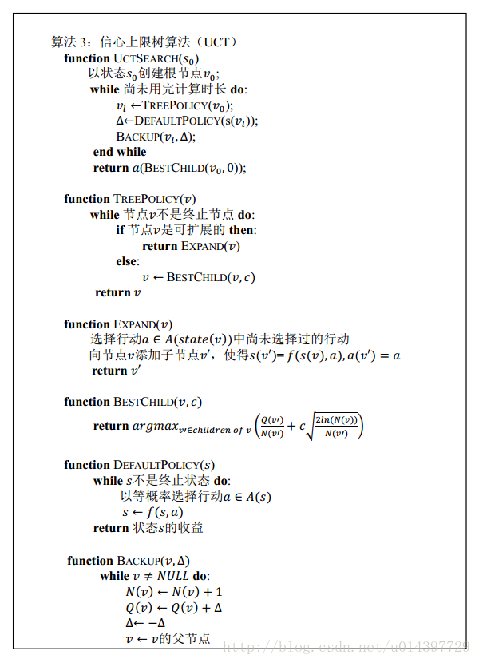
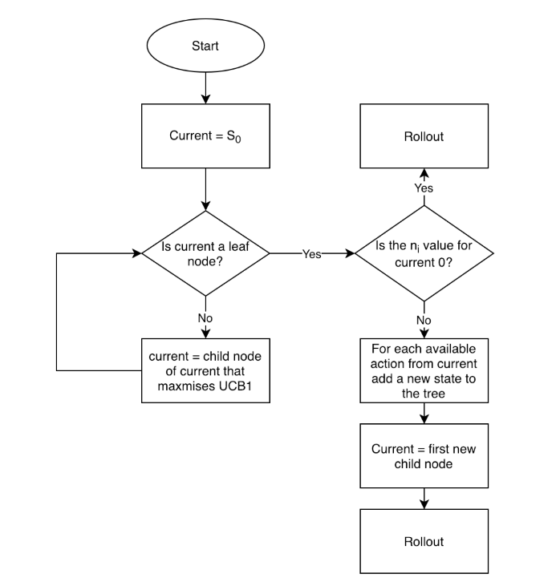

## 重力四子棋 实验报告
计12 曾宪伟 2021010724

**1.算法思路**
使用了基于信心上限算法改进的蒙特卡罗搜索。伪代码如下：

具体过程为：
**选择(selection)**：根据当前获得所有子步骤的统计结果，选择一个最优的子步骤。从根结点 R 开始，选择连续的子结点向下至叶子结点 L 。
**扩展(expansion)**：在当前获得的统计结果不足以计算出下一个步骤时，随机选择一个子步骤。除非任意一方的输赢使得游戏在 L 结束，否则创建一个或多个子结点并选取其中一个结点 C。
**模拟(simulation)**：模拟游戏，进入下一步。在从结点C开始，用随机策略进行游戏，又称为playout或者rollout。
**反向传播(Back-Propagation)**：根据游戏结束的结果，计算对应路径上统计记录的值。使用随机游戏的结果，更新从C到R的路径上的结点信息。
**决策（decision）**：当到了一定的迭代次数或者时间之后结束，选择根节点下最好的子节点作为本次决策的结果。

流程图的形式如下：

针对本题目而言，以当前棋盘状态作为信心上限树的根节点，在时间范围内尽可能多地搜索，每次选择最好的子节点作为下一步。

**2.实现**
使用面向对象编程的方法来实现。具体而言，定义了Node和UCT类，分别负责节点的扩展更新以及局面的模拟。

**3.优化思路**

**3.1 参数更新**
令我方获胜的回报为1，对方获胜的回报为-1，更新每个节点的代价时，不用区分我方和对方节点，只在计算信心上限时区分。

**3.2 关键时刻**
在进入搜索之前，先评估全局态势，若我方存在能直接获胜的位置，不用再搜，直接下那个位置；相反，若存在对方能直接获胜的位置，马上堵住那个位置。

**3.3 先验知识的应用**
如果当前是本节点的第一次拓展，而且存在必胜的策略，直接选择之，进行拓展；若不满足以上条件，且当前节点新产生的一种策略会间接令对方获胜，即对方在这一步上方走子就获胜，那么舍弃该策略，重新随机产生策略。

**3.4 中路**
常识中，将棋子下在中路，有更多的机会向四周拓展，往往能占据更大的主动权。于是对此进行尝试，为中路的棋子分配更大的权重，诱导算法向此拓展，但是在与测试文件对抗时，发现效果并不明显，推测是因为在这个过程中没有做好时序和中路的tradeoff，也就是越到后期，中路就变得越来越不重要，反而更应该随机应变。

实际上过多的优化会影响到搜索的效率，所以在应用时选取其中一些即可

**4.实验效果**
在平台上测试结果如下：

注：派遣的版本（v7）和测评的版本（v4）不同，因为其仍在评测队列中。在本地v7与高水平AI对局结果胜率为：
|编号|胜|负|平
|---|---|---|---
|100|7|3|0|
|98|6|4|0|
|96|8|1|1|
**5.实验总结**
在本次实验中，我实现了信心上限算法，并将其应用于一个实际的问题中，认识到了平衡精细的判断和广泛的搜索的难度和重要性。感谢老师和助教的付出。
